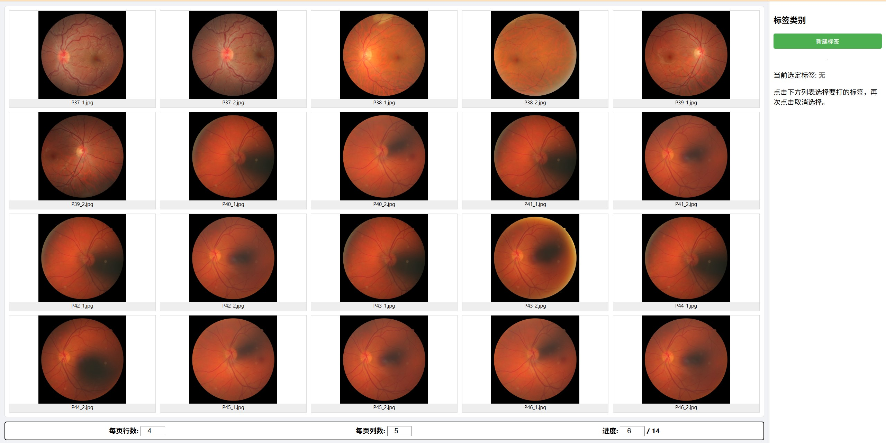

# 实验结果展示与标注工具 / Experimental Result Showcase and Labeling Tool

## 中文说明 / Chinese Description

这是一个用于展示和标注实验结果的Web应用程序。它现阶段支持图像数据类型的展示，并提供了便捷的标签管理功能。文本、视频等数据类型预留的接口，在后续有切实需求的时候再补上。

### 主要特性 / Key Features

<!-- - **多数据类型支持**: 支持图像(.jpg, .png, .bmp等)、文本(.txt, .log, .csv)和视频(.mp4, .webm, .ogg)文件的展示 -->
- **标签管理系统**: 可以创建、重命名、删除标签，并为文件分配标签
- **直观的用户界面**: 使用网格布局展示文件，支持键盘快捷键翻页
- **实时标注**: 可以为文件实时添加或移除标签
- **响应式设计**: 界面适配不同屏幕尺寸

### 快速开始 / Quick Start

1. 确保系统已安装Python环境
2. 运行启动脚本：
   ```bash
   bash run.sh
   ```
3. 在浏览器中打开 `http://localhost:10081` 访问应用

### 使用方法 / Usage

- 使用 `A`/`D` 键或底部控制栏输入对应页数再按 `Enter` 键进行翻页
- 在右侧标签栏中创建和管理标签
- 点击标签进行选中，再次点击取消选中
- 点击文件网格项为文件添加/移除当前选中的标签

### 目录结构 / Directory Structure

```
ExpResultShowDemo/
├── app.py              # 主应用程序文件
├── run.sh              # 启动脚本
├── exp_result/         # 实验结果数据目录
├── label/              # 标签数据目录
├── python_code/        # 数据处理模块目录
├── static/             # 静态资源目录（CSS, JS）
└── templates/          # HTML模板目录
```

### 配置参数 / Configuration Parameters

应用启动时需要以下参数：
- 数据类型: `i`(图像) | `v`(视频) | `t`(文本)
- 数据路径: 包含实验结果文件的目录路径
- 标签路径: 存储标签数据的目录路径
- 端口: Web服务监听端口（可选，默认8080）


### 启动命令 / Startup Command

示例启动命令：
```bash
python app.py i ./exp_result ./label 10081
```

以[FIRE数据集](https://www.ics.forth.gr/cvrl/fire/)为例，启动后界面如下：


## English Description

This is a web application for displaying and labeling experimental results. It currently supports image data type display and provides convenient label management functions. Interfaces for text, video, and other data types are reserved and will be added when there is a genuine need in the future.

### Key Features

<!-- - **Multi-data Type Support**: Supports display of images (.jpg, .png, .bmp, etc.), texts (.txt, .log, .csv), and videos (.mp4, .webm, .ogg) -->
- **Label Management System**: Create, rename, delete labels, and assign labels to files
- **Intuitive User Interface**: Grid layout for file display with keyboard shortcuts for navigation
- **Real-time Labeling**: Add or remove labels from files in real-time
- **Responsive Design**: Interface adapts to different screen sizes

### Quick Start

1. Ensure Python environment is installed on your system
2. Run the startup script:
   ```bash
   bash run.sh
   ```
3. Open `http://localhost:10081` in your browser to access the application

### Usage

- Use `A`/`D` keys or the bottom control bar to navigate pages
- Create and manage labels in the right sidebar
- Click on a label to select it, click again to deselect
- Click on a file grid item to add/remove the currently selected label from the file

### Directory Structure

```
ExpResultShowDemo/
├── app.py              # Main application file
├── run.sh              # Startup script
├── server_config.json  # Server configuration file (generated at runtime)
├── exp_result/         # Experimental result data directory
├── label/              # Label data directory
├── python_code/        # Data processing modules directory
├── static/             # Static resources directory (CSS, JS)
└── templates/          # HTML templates directory
```

### Configuration Parameters

The application requires the following parameters at startup:
- Data type: `i` (image) | `v` (video) | `t` (text)
- Data path: Directory path containing experimental result files
- Label path: Directory path for storing label data
- Port: Web service listening port (optional, defaults to 8080)

Example startup command:
```bash
python app.py i ./exp_result ./label 10081
```

### Startup Command

Example startup command:
```bash
python app.py i ./exp_result ./label 10081
```

Taking [FIRE Dataset](https://www.ics.forth.gr/cvrl/fire/) as an example, the interface after startup is as follows:

> Optimized for Research & Deployment.
